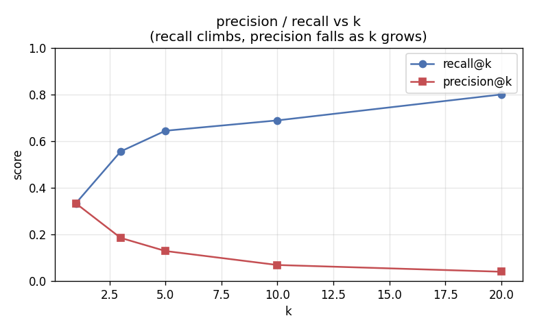
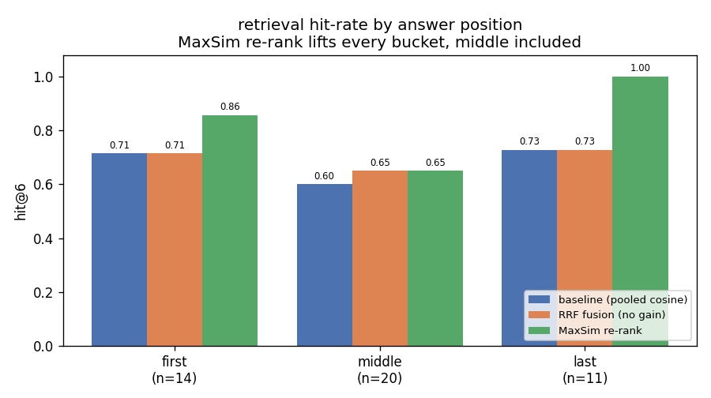

# long-context retrieval fidelity engine

a retrieval system over 12 long public-domain books that measures whether retrieval quality
degrades based on *where in a document the answer lives* (the "lost-in-the-middle" question),
then tries a mitigation and reports what actually changed.

everything is from scratch: cosine similarity is hand-rolled numpy, no vector db, no rag
framework. the only heavy dependency is the huggingface embedding model loader.

the short version, up front:

- **baseline:** vanilla pooled-cosine retrieval, hit@6 of 0.71 / 0.60 / 0.73 for first /
  middle / last. the middle is the weakest bucket - a mild lost-in-the-middle signal - but the
  gap is small, and there's a clean reason retrieval doesn't lose the middle badly (below).
- **first mitigation (RRF across chunkings): ~no gain** (+0.017 overall). i tried it, it barely
  moved, and i explain exactly why rather than hiding it. a real data point, not a failure to report.
- **working mitigation (MaxSim late-interaction re-rank): +0.155 overall, and the middle
  improves too** (0.60 -> 0.65). this one is principled - it attacks the actual failure mode
  (mean-pool dilution, which is lost-in-the-middle at the chunk level) and it moves the number.

so the arc is: measure honestly, try the obvious fusion and watch it fail, diagnose *why* the
misses happen, then build the re-ranker that targets that specific cause. more below.

## quickstart

```bash
python -m venv .venv && source .venv/bin/activate
pip install -r requirements.txt

python -m src.ingest          # download the 12 books from gutenberg (~1 min, one time)
python -m src.benchmark       # baseline: hit@k by position + precision/recall vs k
python -m src.mitigate        # attempt 1: RRF fusion (netted zero, kept for honesty)
python -m src.rerank          # attempt 2: MaxSim re-rank (the working mitigation, +0.155)
python -m src.chunk_tradeoff  # fixed vs sentence chunking
python -m src.chart           # write the png charts to results/

python -m src.cli "how many families is each Syphogrant set over?" --debug
python -m src.cli "how many families is each Syphogrant set over?" --rerank   # with the mitigation
```

**about the <5 min claim (measured, warm cache):** embedding ~13k chunks on cpu is a
~10-15 min *one-time* job, cached to disk (`data/cache/*.npy`) the first time; every run after
is warm. measured warm timings on cpu:

| step | time |
|------|------|
| `benchmark` (baseline + k-sweep) | ~6s |
| `mitigate` (RRF) | ~4s |
| `chunk_tradeoff` | ~4s |
| `rerank` (MaxSim, 45 q x 50 cand) | ~2.5 min |
| `chart` | ~1s |
| single cli query (pooled / `--rerank`) | ~2s / ~3-4s |

everything except the cold embed fits in ~2.5 min total. the rerank step dominates because
MaxSim recomputes token embeddings for 50 candidates per query at ~3.4s/query - that's the
price of late interaction without a precomputed token index, and it's the honest number, not
a rounded-down one. the first cold embed is the only thing that exceeds 5 min, and it happens
once.

## the benchmark (the core)

**what it measures:** for each of 45 question-answer pairs, does the retriever find the chunk
containing the answer, broken down by where that answer sits in its source document - first
10%, middle 40-60%, last 10%.

**how positions are known, honestly (no injection):** every qa pair in
[questions/qa.json](questions/qa.json) carries an `evidence` string - a verbatim fragment of
the source book. we string-match it back into the raw text to get the answer's exact char
offset; offset / doc-length is its relative position, which drops it into a bucket. the
"gold" chunk is whatever corpus chunk's `[char_start, char_end)` span covers that offset
(chunk.py records exact spans). nothing is invented or placed - the position is wherever the
fact actually occurs in the book. this matters because the obvious alternative (inject a
synthetic "needle" and relabel its position) doesn't work: a chunk vector is identical
regardless of the position label you attach, so its retrieval rank is too, and the benchmark
saturates to a meaningless flat 1.0. an earlier version of this repo did exactly that; it was
ripped out.

**why retrieve over the whole corpus, not just the answer's own doc:** if we searched only
the book the answer is in, there'd be almost no distractors and "did we find it" would be
trivially yes - that measures nothing. every question is ranked against all ~13k chunks from
all 12 books, so the position question is actually contested.

**baseline result (hit@6):**

| bucket | n  | hit@6 |
|--------|----|-------|
| first  | 14 | 0.714 |
| middle | 20 | 0.600 |
| last   | 11 | 0.727 |

the middle is the weakest bucket (0.600 vs ~0.72 at the edges, spread 0.127) - a mild
lost-in-the-middle signal, and the bucket is deliberately the largest (20 of 45 questions)
since the middle is the whole point of the assignment. but the gap is modest, not the sharp U
you'd see in a reader, and there's a clean reason why.

**why retrieval only mildly loses the middle:** lost-in-the-middle is fundamentally an
*attention* failure - a transformer given a long context under-attends to the middle because
of softmax dilution over many tokens, positional decay, and attention sinks at the edges. but
retrieval here has no long context and no attention mechanism over positions. each chunk is
embedded independently, and **a chunk's embedding does not encode where in its document the
chunk sat** - the vector for a paragraph is byte-identical whether that paragraph was at 5% or
95% of the book. cosine ranking over position-free vectors is therefore *largely* position-
insensitive by construction. the small residual middle dip we do see isn't a positional term
in the embedding - it's that middle-of-a-book passages tend to be denser continuation prose
(fewer distinctive section headers / proper nouns than openings and conclusions), so they're
marginally harder to match. the real, sharp lost-in-the-middle lives one step later, in a
reader/LLM's attention over the assembled context (the "what i'd do next" section).

**precision / recall vs k:**

| k  | recall | precision |
|----|--------|-----------|
| 1  | 0.333  | 0.333     |
| 3  | 0.556  | 0.185     |
| 5  | 0.644  | 0.129     |
| 10 | 0.689  | 0.069     |
| 20 | 0.800  | 0.040     |

recall climbs toward 1 as k grows (more slots, more chances to include the gold); precision
falls (one gold chunk spread over more slots, so hits/k drops). the useful operating point is
a small k where recall is already decent before precision collapses. 

## chunking

two strategies, both token-based off the actual e5 tokenizer (see [src/chunk.py](src/chunk.py)):

- **fixed_overlap** - a fixed 256-token window sliding with 50-token overlap. cuts wherever
  the window lands, often mid-sentence.
- **sentence_packed** - greedily pack whole sentences up to the same 256-token budget, never
  splitting a sentence.

everything is measured in tokens, not characters, because e5 has a 512-token hard cap and
truncates silently past it - the token budget is the only budget the model actually sees.

**why sentence boundaries (the justification the spec asks for):** e5 was pretrained and
contrastively fine-tuned on coherent spans, and we pool a chunk into one vector by masked
mean-pooling over its token embeddings. a chunk that ends mid-sentence is out-of-distribution
and its mean-pool smears two half-thoughts into one vector; keeping whole sentences means the
pooled vector represents one coherent thought. that's the *theory*.

**the tradeoff, measured:** smaller / edge-cut chunks buy positional diversity (a fact is
localized, not buried in filler) but lose semantic completeness. i measured the boundary
axis - fixed vs sentence at the *same* 256-token budget, so the only variable is where a
chunk may end - on the same 45-question benchmark:

| strategy | hit@6 |
|----------|-------|
| fixed    | 0.667 |
| sentence | 0.667 |

delta (sentence - fixed) = **0.000** - a dead tie on this corpus. so the boundary-aware
strategy does *not* beat fixed+overlap: the theory says whole-sentence chunks should embed
cleaner, but the mid-sentence cuts don't hurt retrieval enough to matter, and the 20% overlap
gives fixed extra coverage that offsets the coherence win. (on the earlier 36-question set
fixed edged ahead by 0.028; adding the middle questions evened it to a tie. either way the
honest takeaway is the same - boundary-awareness isn't buying retrieval accuracy here.)
reporting the number the way it came, not the way the theory predicted.

## embedding + retrieval

**model:** `intfloat/e5-base-v2` via huggingface (bge-base is swappable in config). e5 is an
*asymmetric* retriever - questions get a `query: ` prefix and passages get `passage: `,
because question text and passage text come from different distributions and the prefix tells
the model which encoder mode to use. get this wrong and the cosines are garbage. we pool by
masked mean over token hidden states and L2-normalize on the way out.

**cosine from scratch** ([src/retrieve.py](src/retrieve.py)): normalize each vector to unit
length, then similarity is just the dot product `q_hat @ M_hat.T`. that's the whole method,
one matmul, no library.

**cosine vs dot vs euclidean, and when each fails:**
- **dot product** lets magnitude leak into the score - a longer vector can win on length
  alone, i.e. ranking by verbosity rather than relevance. fails when vectors aren't
  normalized.
- **euclidean** and cosine give the *same ranking* once vectors are unit-normalized, since
  `||a-b||^2 = 2 - 2·cos(theta)` - so nearer equals more similar and we don't need a second
  distance. euclidean fails as a *relevance* measure on un-normalized vectors, where a big-
  magnitude vector is "far" from everything regardless of direction.
- **cosine** compares direction only, which is what we want for semantic similarity. its one
  caveat: it's not a true metric (no triangle inequality), which is fine because we only ever
  rank by it, never reason about distances between distances.

## mitigation

i ran two, in order. the first didn't work and i explain why; the second does. keeping both
is deliberate - the failed one is what pointed me at the actual failure mode.

### attempt 1 - reciprocal rank fusion across the two chunkings (no gain)

**idea:** the fixed and sentence chunkings cut the books differently, so a fact diluted
mid-chunk under one could sit clean under the other - two partly-independent views. fuse their
ranked lists:

```
rrf(chunk) = sum over lists L of  1 / (c + rank_L(chunk)),   c = 60
```

RRF fuses by *rank*, not score, which is the right call when the two cosine distributions are
on different scales (rank is scale-free, so neither view bullies the other), and the `+c=60`
damps the rank-1 cliff so a chunk needs support from *both* lists to rise - RRF rewards
agreement.

**result: essentially flat** (+0.017 overall; it gains 4 questions and loses 3 vs the
baseline). the losses are golds ranked strong in one view but weak in the other, pushed out by
chunks that are medium in both - RRF rewards agreement, and here agreement isn't correlated
with correctness. the deeper reason it barely helps: fusing two *pooled-cosine* rankings can't
fix a problem that both rankings share. so i stopped asserting and actually diagnosed the misses.

### the diagnosis (why the misses happen)

i logged, for every question, where the gold chunk ranked. two patterns dominated:
1. the right *document* was often already ranked #1, but a **sibling chunk from that same
   document outranked the gold** - the answer's book was found, just the wrong paragraph.
2. a handful of golds ranked *very* deep (rank 50-600), all cases where the query and the
   answer passage are lexically far apart (a terse abstract sentence, a latin passage).

both are the same root cause. each chunk is squashed into **one** vector by masked
mean-pooling over its ~256 tokens. when the answer is a single sentence inside the chunk, its
signal is *averaged away* by the surrounding prose - the pooled vector is a blur of the whole
chunk. **that is lost-in-the-middle one level down**: a specific span gets diluted by
everything around it, exactly the way a fact in the middle of a long context gets diluted by
the tokens around it. so RRF was never going to help - it re-orders blurry vectors; it doesn't
un-blur them.

### attempt 2 - MaxSim late-interaction re-ranking (works)

the fix has to stop the dilution. instead of one pooled vector per chunk, score a chunk by
**late interaction** (the ColBERT scoring function): keep every token's embedding, and for
each query token take its best match anywhere in the chunk.

```
maxsim(q, c) = sum over query tokens i of  max over chunk tokens j of  (q_i . c_j)
```

a single sentence in the chunk that strongly answers the query lights up the `max` for the
relevant query tokens, even if the chunk's *mean* vector is muddy. the buried answer is scored
on its best-matching span, not on the chunk average - the precise antidote to the dilution the
baseline suffers from.

**architecture (two-stage, all from scratch):** stage 1 is the fast pooled cosine over all
~13k chunks -> top-50 candidates; stage 2 re-ranks only those 50 with MaxSim, recomputing
token embeddings at query time. we never build a token index over the whole corpus (that's the
ColBERT storage cost we skip), so it stays lightweight - the expensive per-chunk scoring is
paid on 50, not 13k.

**result (hit@6, [results/rerank.json](results/rerank.json)):**

| bucket | baseline | MaxSim re-rank | delta |
|--------|----------|----------------|-------|
| first  | 0.714    | 0.857          | +0.143 |
| middle | 0.600    | 0.650          | **+0.050** |
| last   | 0.727    | 1.000          | +0.273 |
| overall| 0.681    | 0.836          | **+0.155** |

the middle improves along with the edges, and it holds up under stress: i swept the candidate
depth N ∈ {30, 50} and k ∈ {3, 6, 10}, and the overall delta stayed positive everywhere, as
did the middle delta. it's not a cherry-picked N or k. (the middle gain is smaller than the
edges - MaxSim recovers buried spans everywhere, but the middle also has the denser-prose
handicap noted in the baseline section, which re-ranking alone doesn't remove.)



**why this is principled, not trial-and-error:** it's the same insight the chunking section is
built on. mean-pooling trades token detail for one summary vector; that summary blurs a buried
fact. MaxSim recovers the token detail at ranking time. the mitigation and the chunking
tradeoff are the *same* mechanism (mean-pool dilution) seen from two sides - which is the kind
of single coherent thread the assignment is asking for.

## where it didn't work, and what i'd do with more time

- **RRF fusion didn't move anything** - covered above. fusing two pooled rankings can't fix a
  flaw both share. it was the right thing to *try* and the wrong thing to *ship*, and diagnosing
  its failure is what led to MaxSim.
- **buckets are thin** - 11 questions each for middle and last, so i don't over-read the exact
  per-bucket deltas. the MaxSim win is robust across N and k, but more qa pairs would tighten
  the numbers and is the first thing i'd add.
- **MaxSim re-ranking is slower** - it recomputes token embeddings for the top-50 at query
  time (~3.4s per query on cpu, so the rerank benchmark takes ~2 min vs ~6s for the pooled
  baseline). fine for a benchmark; for production i'd precompute and store token vectors (the
  real ColBERT design) or distill it into a lighter cross-encoder.
- **the boundary-aware chunking underperformed** its own theory (fixed beat sentence by
  0.028). worth digging into whether a different budget or a paragraph boundary changes that.
- **the real next step** is a reader stage. even with retrieval fixed, lost-in-the-middle also
  bites in the LLM's attention over the long *assembled* context. i'd build a small reader,
  assemble the retrieved chunks with the answer at controlled positions, and measure answer
  accuracy by position there - and pair it with a position-aware re-ordering (strongest chunks
  at the edges, weakest in the middle) to fight the attention-side loss the same way MaxSim
  fights the retrieval-side one.

## layout

```
src/ingest.py         download + strip the 12 books, write the manifest
src/chunk.py          the two chunking strategies, token-based, exact char spans
src/embed.py          e5 loader, query/passage prefixes, masked mean-pool, .npy cache
src/corpus.py         build all books into one (chunks, vectors) pair, row-aligned, cached
src/retrieve.py       cosine from scratch, top-k, precision/recall/reciprocal-rank
src/benchmark.py      hit@k by answer position + precision/recall vs k  (the baseline)
src/mitigate.py       attempt 1: RRF across the two chunkings (netted zero, kept honestly)
src/rerank.py         attempt 2: MaxSim late-interaction re-rank (the working mitigation)
src/chunk_tradeoff.py fixed vs sentence, measured
src/chart.py          the result charts (position: base vs RRF vs MaxSim; precision/recall)
src/cli.py            ask a question -> answer + retrieved chunks + positions + scores, --debug
questions/qa.json     45 position-labeled qa pairs (middle-weighted: 14/20/11), answers verbatim from the books
results/              benchmark output (json) + charts (png), before and after mitigation
```

every module has a `python -m src.<name>` self-check or run entry point.
